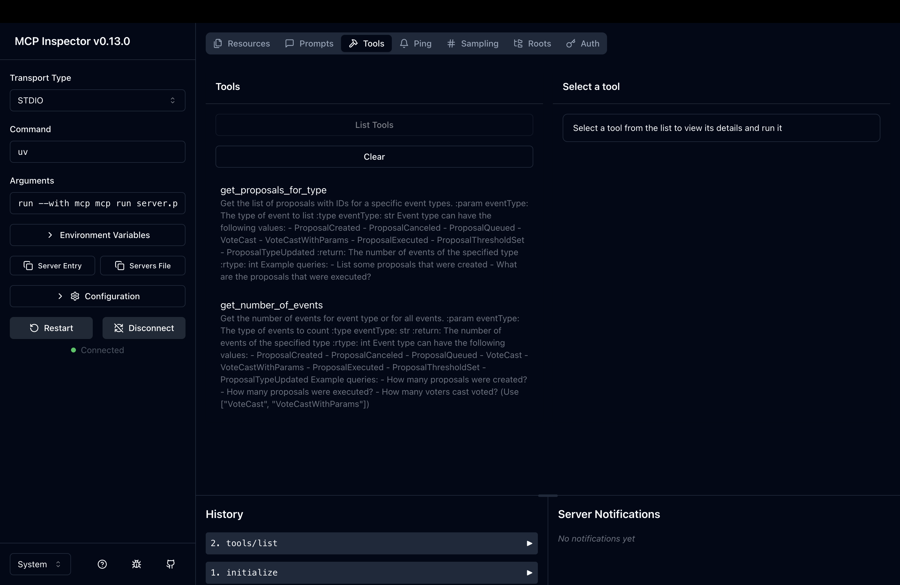

# OPGovWatch MCP Server

This MCP repo defines the tools used for the OpGovernance Chat App.

It uses the [MCP Protocal](https://modelcontextprotocol.io/introduction).

## Setup

### Prerequisite

1. Have `python>=3.10` installed on your system.
2. We recommend using [uv](https://docs.astral.sh/uv/) to manage your Python projects.
3. Clone the repo.
4. You should have `indexer` database in a MongoDB Server. Tools require a connection to mongodb server with `MONGODB_URI` env variable, so make sure it's available before running the process.

> Note: To test on sample events locally, we have added a database dump in this repo. Check `indexer.zip`.  
> Use the command `mongorestore --db indexer events.bson` to import the `events`  and other collections.

### Debug tools with the MCP Inspector

1. Run the command `uv run --with mcp mcp dev server.py` to start the MCP Inspector.
2. Connect to the MCP server using STDIO transport type and go to the tools tab

When you have debugged that tools work correctly, you can connect this MCP server with the **OpGovWatch Chat App**.